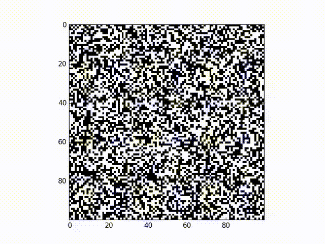

# GameOfLife - High Performance Computing methods

By Oscar Bennett

This project is a C++ implementation of Conway's Game of Life. This is a program that simulates a world which produces interesting animations dependant on the initial conditions and world rules you choose. Here is an example of one of the simulations created using a random initialisation in a small square 'world':

A nice explanation of the ideas can be found [here](https://en.wikipedia.org/wiki/Conway%27s_Game_of_Life). Running the simulation is numerically intensive but the calculations involved are a good example of an [embarrassingly parallel](https://en.wikipedia.org/wiki/Embarrassingly_parallel) program. Because of this the program is a nice way of demonstrating various ways of speeding up computation using high performance computing technologies. I have created a series of different implementations using a range of methods. See below for details about each approach. Different git branches in this repository parallelize the code in different ways:

- serial
- OpenMP
- MPI
- CUDA

The resulting data files can by converted into a video using the Python script `make_video.py`. Additionally scripts have been included which automate the process of measuring performance changes with different parellelization parameters.

NOTE: Using the `make_video.py` script to generate a video file for visualization requires an installation of ffmpeg on your system.

The project has been setup so that it can be easily run on UCL's cluster called Legion. While all the branches of this repository can be easily run on Legion (or any other cluster in principle), they can only be run locally if your local system has the necessary dependancies.

To run the code on Legion you need to have a UCL Legion account and be connected the the UCL network (ie to UCL eduroam). If you setup a UCL VPN on your computer you don't need to be connected to the UCL network.

NOTE: Local building requires CMake, whilst running the scripts to deploy the code on Legion requires the python modules Fabric and Mako.

The execution of the code is controlled by a `config.yml` file. Modify this file to specify parameter values for the simulation. The variable parameters are:

- sizex: The size of the x (or horizontal) dimension of the cell field
- sizey: The size of the y (or vertical) dimension of the cell field
- EndOfDays: The number of update steps to run the simulation for
- Pseudorandom: Initialize the cell field pseudorandomly (set to 1) or truly randomly (set to 0)
- verbose: Verbose output (set to 1) or quiet output (set to 0)

Example results from each branch are provided in the folder example_results. These results include the printed std output from the program along with the video created from the results of the computation. The raw output data has not been included as these files are very large.

******************************************************************************
### SERIAL BRANCH:

This can be built and run locally or on Legion.

To build locally:
- git clone https://github.com/ofbennett/GameOfLife.git
- cd GameOfLife
- git checkout serial
- mkdir ../build
- cd ../build
- ccmake ../GameOfLife
- -> Hit c to configure
- -> Hit c to configure
- -> Hit g to generate a make file
- make

To run the unit tests:
- test/test_GoL

Then to execute the code with default parameters:
- src/game_of_life

Alternatively to execute the code with your own parameters:
- -> Modify the config.yml file to contain the simulation parameters of your choice
- src/game_of_life ../GameOfLife/config.yml

Then to create a video from the output:
- python ../GameOfLife/make_video.py output.txt

DONE

To build and run the code on Legion:  
There are a series of Fabric functions that can be called to carry this out conveniently. However, before you can do this you need to modify the file `deploy/legion.py`. You need to replace my Legion user name (at the top of the file) with yours.

Commands:
- git clone https://github.com/ofbennett/GameOfLife.git
- cd GameOfLife
- git checkout serial
- -> Modify deploy/legion.py file, replacing my Legion user name with yours.
- -> Modify config.yml file to contain the simulation parameters of your choice
- fab legion.cold
- -> Tests are automatically run after the build
- fab legion.sub
- fab legion.wait
- fab legion.fetch_all
- fab legion.cleanup_all (If you want to delete the build and results from your Legion account)
- python make_video.py results/latest_results/legion.rc.ucl.ac.uk/output.txt

Alternatively, if you have access to a bash shell you can run this whole pipeline by executing the supplied shell script like this:
- bash legion_pipeline.sh

******************************************************************************
### OPENMP BRANCH:

OpenMP is a C++ library which makes it very convenient to parallelize the execution of parts of your code across multiple cores on a single computer. This branch of the repository contains a version of the GameOfLife code which does this.

This code can either be built and run locally or deployed onto Legion. If you were able to build and run the serial version of the code locally (in the manner explained above) then you will be able to build and run this OpenMP version locally as well. However, you will need to have a C++ compiler which supports OpenMP if you want the code to run in parellel. If you don't the code will simply execute serially. Compilers on Legion support OpenMP.

Building and running locally:  
The steps to carry this out are the same as for the serial branch above except you checkout the OpenMP branch rather than the serial one:
git checkout OpenMP

Building and running on Legion:  
The steps to carry this out are the same as for the serial branch above. However, if you would like to control the number of cores the execution will distribute across (default 4) you can do so by slightly modifying the 'sub' fabric command. For example if you would like to use 12 cores you would type this command instead:

- fab legion.sub:processes=12

As with the serial branch, running the legion_pipeline.sh bash script will carry out the whole Legion deployment pipeline automatically.

There is also a bash script entitled `create_performance_graph.sh`. Running this will automatically run the code on Legion multiple times with different core numbers, time each execution, and then construct a graph of the run time vs core number. This is a nice way to see Amdahl's law in action! Warning: this script can take a while to execute depending on how busy Legion is (0.5 - 1 hour).

******************************************************************************
### MPI BRANCH:

The Message Passing Interface (MPI) allows the parallel execution of code on multiple separate computers, or nodes on a cluster. I used the C++ library OpenMPI to parallelize execution of the GameOfLife code in this manner.

Building and running locally:  
This version of the code needs to be built and run on a system which has OpenMPI (and its dependancies) installed. These can be locally installed easily using something like Homebrew on a Mac. The code is then built and run locally in the same way as the serial branch (except you "git checkout MPI"). However, given the nature of the way this code is parallelized, there isn't much point running it on an isolated local machine (it will simply run serially in a more complicated way). This MPI version of the code should be deployed onto a cluster such as Legion to take advantage of the MPI performance improvement.

Building and running on Legion:  
The steps to carry this out are the same as for the serial and OpenMP branches above. If you want 12 nodes, for example, (default 4) then use the command:

- fab legion.sub:processes=12

As with the OpenMP branch there are bash scripts available to automate things. The `legion_pipeline.sh` script will carry out the Legion deployment pipeline. The `create_performance_graph.sh` will measure the run time using multiple different node numbers and construct a graph (Amdahl's law!). Warning: this graph script can take a while to execute depending on how busy Legion is (0.5 - 1 hour).

Because the code execution involves complicated communication between nodes, in order to really mean anything the code tests also need to be run on Legion! To run the tests simply run the supplied bash script:

- bash test_script.sh

The test results will be fetched back as a file that looks like `GameOfLife.o*` with some trailing numbers. This is a text file which contains the printed results from the tests.

******************************************************************************
### CUDA BRANCH:

CUDA is an API created by NVIDIA which allows programs to be executed in parallel across a CUDA-enabled GPU. I used a C++ library called CUDA Thrust to parallelize the GameOfLife code on a GPU in this manner.

Building and running locally:  
This version of the code needs to be built and run on a system which has both an NVIDIA GPU and a working installation of CUDA. If your local system meets these requirements then the code can be built and run locally in the same way as the serial branch (except you "git checkout CUDA").

Building and running on Legion:  
The steps to carry this out are the same as for the serial branch. As with previous branches there are bash scripts to automate things. The `legion_pipeline.sh` script carries out the Legion deployment pipeline. The `test_script.sh` script will deploy and run the code tests on legion. The test results will be fetched back as a file that looks like `GameOfLife.o*` with some trailing numbers. This is a text file which contains the printed results from the tests.
